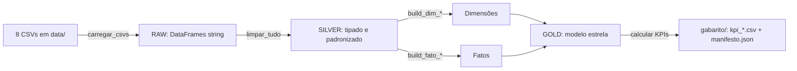
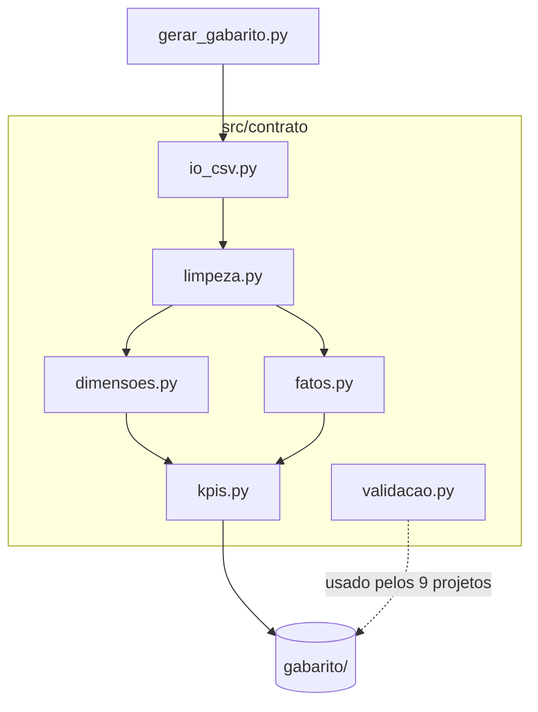
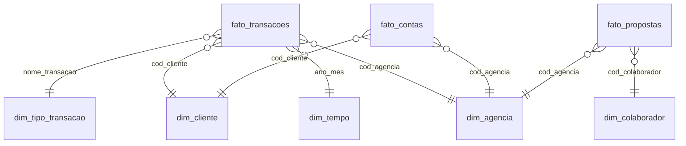

# Projeto 0 — Fundação: Plano de Implementação

> **For agentic workers:** REQUIRED SUB-SKILL: Use superpowers:subagent-driven-development (recommended) or superpowers:executing-plans to implement this plan task-by-task. Steps use checkbox (`- [ ]`) syntax for tracking.

**Goal:** Construir `projeto-00-fundacao/` — o contrato compartilhado (dicionário de dados, contrato de limpeza, modelo estrela, 8 perguntas de negócio) e o **gabarito** com os números canônicos que os 9 projetos de ETL/ELT vão validar.

**Architecture:** Um pacote Python (`src/contrato/`) com funções puras e testáveis para cada etapa — limpeza (raw→silver), construção de dimensões e fatos (silver→gold), cálculo dos 8 KPIs, e uma função de validação tool-agnóstica. Um orquestrador (`gerar_gabarito.py`) roda tudo e grava os artefatos em `gabarito/`. A documentação didática em `docs/` descreve o contrato em PT-BR. Tudo roda via Docker (padrão) ou venv local.

**Tech Stack:** Python 3.12, pandas, pyarrow (Parquet), pytest. Docker + docker compose. Markdown + Mermaid para docs.

**Decisões de modelagem (fixadas para serem determinísticas e idênticas em todos os projetos):**
- `DATA_REFERENCIA = 2023-12-31` — data-base para calcular idade/faixa etária dos clientes.
- Correção IPCA: mês-base = o `ano_mes` mais recente presente em `ipca.csv`; `real = nominal × indice_base / indice_mes`.
- Proposta → agência: via colaborador (`cod_colaborador` → `colaborador_agencia` → `cod_agencia`); se o colaborador atende várias agências, usar a de menor `cod_agencia` (agência principal).
- Transação → agência: via `num_conta` → `contas.cod_agencia`.
- `ano_mes`: string no formato `YYYY-MM`.
- Convenção de sinal: `valor_transacao` negativo = saída; positivo = entrada.
- **Grão de `fato_contas` = 1 linha por conta (999 linhas).** Representa o snapshot corrente do
  saldo no momento da extração; histórico de saldo não existe nesta tabela — é derivado de
  `fato_transacoes`.
- **Escopo do gabarito = full-load.** Cargas incrementais (P5/Airflow, P6/dbt incremental,
  P7/Delta upsert) não têm gabarito automático; cada projeto documenta sua própria estratégia de
  validação incremental no README.

**Números reais já perfilados (usados em testes e no manifesto):**
- Linhas de dados: clientes 998, colaboradores 100, agencias 10, colaborador_agencia 100, contas 999, transacoes **71.999**, propostas_credito 2.000, ipca 155.
- `status_proposta`: Aprovada 514, Em análise 468, Enviada 527, Validação documentos 491.
- `nome_transacao` "Pix - Realizado" = **13.164** ocorrências.
- `tipo_cliente`: 100% PF.

**Mapa de categorias de transação (`dim_tipo_transacao`):**

| categoria | nome_transacao incluídos |
|---|---|
| Pix | Pix - Realizado, Pix - Recebido, Pix Saque |
| Cartão | Compra Crédito, Compra Débito |
| Saque/Depósito | Saque, Depósito em espécie |
| Transferência | DOC - Realizado, DOC - Recebido, TED - Realizado, TED - Recebido, Transferência entre CC - Crédito, Transferência entre CC - Débito |
| Outros | Pagamento de boleto, Estorno de Debito |

---

## Estrutura de arquivos

```
projeto-00-fundacao/
  README.md                      # passo a passo didático (Task 9)
  requirements.txt               # pandas, pyarrow, pytest (Task 1)
  Dockerfile                     # python:3.12-slim (Task 1)
  docker-compose.yml             # roda gerar_gabarito.py com ../data montado RO (Task 1)
  pytest.ini                     # config de testes (Task 1)
  src/
    __init__.py
    config.py                    # constantes do contrato (Task 2)
    contrato/
      __init__.py
      io_csv.py                  # carregar os 8 CSVs (Task 2)
      limpeza.py                 # helpers + limpar_* (raw→silver) (Task 3)
      dimensoes.py               # build_dim_* (Task 4)
      fatos.py                   # build_fato_* (Task 5)
      kpis.py                    # calcular_kpis (8 KPIs) (Task 6)
      validacao.py               # validar_gold(...) tool-agnóstico (Task 7)
    gerar_gabarito.py            # orquestrador (Task 8)
  tests/
    conftest.py                  # fixtures: caminho data/, mini-amostras (Task 2)
    test_io_csv.py               # (Task 2)
    test_limpeza.py              # (Task 3)
    test_dimensoes.py            # (Task 4)
    test_fatos.py                # (Task 5)
    test_kpis.py                 # (Task 6)
    test_validacao.py            # (Task 7)
  gabarito/                      # GERADO pelo orquestrador (Task 8): *.parquet, kpi_*.csv, manifesto.json
  docs/
    dicionario-de-dados.md       # (Task 10)
    contrato-de-limpeza.md       # (Task 10)
    modelo-estrela.md            # (Task 10)
    perguntas-de-negocio.md      # (Task 10)
    arquitetura.md               # Mermaid (Task 9)
    fluxo-de-dados.md            # Mermaid (Task 9)
```

A fonte `data/` fica na raiz do repositório (um nível acima desta pasta). O código a referencia por
um caminho configurável (`DATA_DIR`), default `../data` relativo à raiz do projeto.

> **Nota sobre git:** este repositório ainda não é um repo git. A Task 1 inicia o git. Se o usuário
> preferir não versionar, pule os passos `git commit` — eles não afetam o funcionamento do código.

---

## Task 1: Scaffolding do projeto (pasta, deps, Docker, git)

**Files:**
- Create: `projeto-00-fundacao/requirements.txt`
- Create: `projeto-00-fundacao/Dockerfile`
- Create: `projeto-00-fundacao/docker-compose.yml`
- Create: `projeto-00-fundacao/pytest.ini`
- Create: `projeto-00-fundacao/.gitignore`
- Create: `projeto-00-fundacao/src/__init__.py` (vazio)
- Create: `projeto-00-fundacao/src/contrato/__init__.py` (vazio)

- [ ] **Step 1: Inicializar git na raiz do repositório (se ainda não houver)**

Run (na raiz `C:\Projeto\ETL e ELT`):
```bash
git init
git add data/
git commit -m "chore: dados-fonte do banco (8 CSVs)"
```
Expected: repositório criado; primeiro commit com a pasta `data/`.

- [ ] **Step 2: Criar `requirements.txt`**

```text
pandas==2.2.2
pyarrow==16.1.0
pytest==8.2.0
```

- [ ] **Step 3: Criar `pytest.ini`**

```ini
[pytest]
testpaths = tests
python_files = test_*.py
addopts = -v
```

- [ ] **Step 4: Criar `.gitignore`**

```text
__pycache__/
*.pyc
.venv/
gabarito/
```

(O `gabarito/` é gerado; pode ser versionado depois se quiser, mas começamos ignorando.)

- [ ] **Step 5: Criar `Dockerfile`**

```dockerfile
FROM python:3.12-slim
WORKDIR /app
COPY requirements.txt .
RUN pip install --no-cache-dir -r requirements.txt
COPY . .
CMD ["python", "src/gerar_gabarito.py"]
```

- [ ] **Step 6: Criar `docker-compose.yml`**

```yaml
services:
  fundacao:
    build: .
    volumes:
      - ../data:/data:ro          # fonte montada SOMENTE LEITURA
      - ./gabarito:/app/gabarito  # saída do gabarito
    environment:
      - DATA_DIR=/data
```

- [ ] **Step 7: Criar os `__init__.py` vazios**

Create `src/__init__.py` e `src/contrato/__init__.py` (ambos vazios).

- [ ] **Step 8: Criar o ambiente virtual local e instalar deps (para rodar testes nesta sessão)**

Run:
```bash
cd "C:/Projeto/ETL e ELT/projeto-00-fundacao"
python -m venv .venv
.venv/Scripts/python -m pip install -r requirements.txt
```
Expected: pandas, pyarrow, pytest instalados.

- [ ] **Step 9: Commit**

```bash
git add projeto-00-fundacao/
git commit -m "chore(p0): scaffolding do projeto-00-fundacao (deps, docker, pytest)"
```

---

## Task 2: Configuração e carregamento dos CSVs

**Files:**
- Create: `projeto-00-fundacao/src/config.py`
- Create: `projeto-00-fundacao/src/contrato/io_csv.py`
- Create: `projeto-00-fundacao/tests/conftest.py`
- Test: `projeto-00-fundacao/tests/test_io_csv.py`

- [ ] **Step 1: Criar `src/config.py` com as constantes do contrato**

```python
"""Constantes do contrato compartilhado (Projeto 0)."""
import os
from datetime import date
from pathlib import Path

# Diretório da fonte (CSVs). Default: ../data relativo à raiz do projeto.
RAIZ_PROJETO = Path(__file__).resolve().parents[1]
DATA_DIR = Path(os.environ.get("DATA_DIR", RAIZ_PROJETO.parent / "data"))
GABARITO_DIR = RAIZ_PROJETO / "gabarito"

# Data-base da análise (idade/faixa etária dos clientes).
DATA_REFERENCIA = date(2023, 12, 31)

# Tolerância relativa para comparação de valores na validação.
TOLERANCIA = 1e-6

# Os 8 arquivos esperados (sem extensão).
TABELAS = [
    "agencias", "clientes", "colaboradores", "colaborador_agencia",
    "contas", "transacoes", "propostas_credito", "ipca",
]

# nome_transacao -> categoria (dim_tipo_transacao).
CATEGORIA_TRANSACAO = {
    "Pix - Realizado": "Pix", "Pix - Recebido": "Pix", "Pix Saque": "Pix",
    "Compra Crédito": "Cartão", "Compra Débito": "Cartão",
    "Saque": "Saque/Depósito", "Depósito em espécie": "Saque/Depósito",
    "DOC - Realizado": "Transferência", "DOC - Recebido": "Transferência",
    "TED - Realizado": "Transferência", "TED - Recebido": "Transferência",
    "Transferência entre CC - Crédito": "Transferência",
    "Transferência entre CC - Débito": "Transferência",
    "Pagamento de boleto": "Outros", "Estorno de Debito": "Outros",
}

MESES = {"JAN": 1, "FEV": 2, "MAR": 3, "ABR": 4, "MAI": 5, "JUN": 6,
         "JUL": 7, "AGO": 8, "SET": 9, "OUT": 10, "NOV": 11, "DEZ": 12}
```

- [ ] **Step 2: Escrever o teste de carregamento (vai falhar)**

`tests/conftest.py`:
```python
import pytest
from src import config

@pytest.fixture(scope="session")
def brutos():
    from src.contrato.io_csv import carregar_csvs
    return carregar_csvs(config.DATA_DIR)
```

`tests/test_io_csv.py`:
```python
def test_carrega_as_8_tabelas(brutos):
    esperadas = {"agencias", "clientes", "colaboradores", "colaborador_agencia",
                 "contas", "transacoes", "propostas_credito", "ipca"}
    assert set(brutos.keys()) == esperadas

def test_contagem_de_linhas(brutos):
    assert len(brutos["clientes"]) == 998
    assert len(brutos["transacoes"]) == 71999
    assert len(brutos["propostas_credito"]) == 2000
    assert len(brutos["agencias"]) == 10

def test_ipca_tem_coluna_ano_duplicada_renomeada(brutos):
    # pandas renomeia a 2ª 'ano' para 'ano.1' na leitura crua
    assert "ano.1" in brutos["ipca"].columns
```

- [ ] **Step 3: Rodar o teste para ver falhar**

Run: `.venv/Scripts/python -m pytest tests/test_io_csv.py -v`
Expected: FAIL — `ModuleNotFoundError: No module named 'src.contrato.io_csv'`.

- [ ] **Step 4: Implementar `src/contrato/io_csv.py`**

```python
"""Carrega os 8 CSVs da fonte como DataFrames crus (tudo string)."""
from pathlib import Path
import pandas as pd
from src import config

def carregar_csvs(data_dir: Path) -> dict[str, pd.DataFrame]:
    """Lê os 8 arquivos. Tudo como string (dtype=str) para limpar depois
    sem o pandas adivinhar tipos errados. mantém colunas duplicadas (ipca)."""
    dados = {}
    for nome in config.TABELAS:
        caminho = Path(data_dir) / f"{nome}.csv"
        dados[nome] = pd.read_csv(caminho, dtype=str, keep_default_na=False)
    return dados
```

- [ ] **Step 5: Rodar o teste para ver passar**

Run: `.venv/Scripts/python -m pytest tests/test_io_csv.py -v`
Expected: PASS (3 testes).

- [ ] **Step 6: Commit**

```bash
git add projeto-00-fundacao/src/config.py projeto-00-fundacao/src/contrato/io_csv.py projeto-00-fundacao/tests/
git commit -m "feat(p0): config do contrato + carregamento dos 8 CSVs"
```

---

## Task 3: Limpeza (raw → silver)

**Files:**
- Create: `projeto-00-fundacao/src/contrato/limpeza.py`
- Test: `projeto-00-fundacao/tests/test_limpeza.py`

- [ ] **Step 1: Escrever os testes das funções de limpeza (vão falhar)**

`tests/test_limpeza.py`:
```python
import pandas as pd
from src.contrato import limpeza

def test_normalizar_cep_remove_mascara_e_pad():
    assert limpeza.normalizar_cep("95140-704") == "95140704"
    assert limpeza.normalizar_cep("51779625") == "51779625"
    assert limpeza.normalizar_cep("8955-215") == "08955215"  # zfill p/ 8

def test_normalizar_cpf_so_digitos():
    assert limpeza.normalizar_cpf("357.081.496-39") == "35708149639"

def test_arredondar_centavos():
    assert limpeza.arredondar_centavos(2984.7614999999996) == 2984.76

def test_extrair_uf_do_endereco():
    assert limpeza.extrair_uf("Praia de Duarte 81327-166 Fernandes / SP") == "SP"
    assert limpeza.extrair_uf("Endereço sem uf reconhecível") is None

def test_limpar_ipca(brutos):
    df = limpeza.limpar_ipca(brutos["ipca"])
    assert "acumulado_ano" in df.columns          # 2ª 'ano' renomeada
    assert "ano.1" not in df.columns
    assert df.loc[0, "ano_mes"] == "2010-01"      # 1ª linha: 2010 / JAN
    assert df.loc[0, "indice"] == 3040.22

def test_limpar_transacoes_cria_ano_mes_e_categoria(brutos):
    df = limpeza.limpar_transacoes(brutos["transacoes"])
    assert df["valor_transacao"].dtype.kind == "f"
    assert set(["ano_mes", "categoria"]).issubset(df.columns)
    assert (df["categoria"] == "Pix").sum() > 0

def test_limpar_contas_arredonda_saldo(brutos):
    df = limpeza.limpar_contas(brutos["contas"])
    # nenhum saldo com mais de 2 casas decimais
    assert (df["saldo_total"].round(2) == df["saldo_total"]).all()
```

- [ ] **Step 2: Rodar para ver falhar**

Run: `.venv/Scripts/python -m pytest tests/test_limpeza.py -v`
Expected: FAIL — `ImportError`/`AttributeError` (funções não existem).

- [ ] **Step 3: Implementar `src/contrato/limpeza.py`**

```python
"""Funções de limpeza raw->silver. Cada regra do contrato vira uma função pura."""
import re
import pandas as pd
from src import config

# ---------- helpers ----------
def normalizar_cep(cep: str) -> str | None:
    if cep is None:
        return None
    digitos = re.sub(r"\D", "", str(cep))
    if digitos == "":
        return None
    return digitos.zfill(8)[:8]

def normalizar_cpf(doc: str) -> str | None:
    if doc is None:
        return None
    digitos = re.sub(r"\D", "", str(doc))
    return digitos or None

def arredondar_centavos(valor) -> float:
    return round(float(valor), 2)

def extrair_uf(endereco: str) -> str | None:
    """Tenta achar a UF no fim do endereço no padrão '/ XX'."""
    if not endereco:
        return None
    m = re.search(r"/\s*([A-Z]{2})\b", str(endereco))
    return m.group(1) if m else None

def _ts(serie: pd.Series) -> pd.Series:
    """Converte texto '2017-04-03 16:11:00 UTC' -> timestamp (UTC removido)."""
    return pd.to_datetime(serie.str.replace(" UTC", "", regex=False),
                          errors="coerce", utc=False)

# ---------- limpeza por tabela ----------
def limpar_ipca(df: pd.DataFrame) -> pd.DataFrame:
    df = df.rename(columns={"ano.1": "acumulado_ano"}).copy()
    df["mes_num"] = df["mes"].str.upper().map(config.MESES)
    df["ano_mes"] = df["ano"].astype(int).astype(str) + "-" + df["mes_num"].astype(int).astype(str).str.zfill(2)
    for col in ["indice", "no_mes", "3_meses", "6_meses", "acumulado_ano", "12_meses"]:
        df[col] = pd.to_numeric(df[col], errors="coerce")
    return df

def limpar_clientes(df: pd.DataFrame) -> pd.DataFrame:
    df = df.copy()
    df["cpfcnpj"] = df["cpfcnpj"].map(normalizar_cpf)
    df["cep"] = df["cep"].map(normalizar_cep)
    df["data_inclusao"] = _ts(df["data_inclusao"])
    df["data_nascimento"] = pd.to_datetime(df["data_nascimento"], errors="coerce")
    df["uf"] = df["endereco"].map(extrair_uf)
    df["cod_cliente"] = df["cod_cliente"].astype(int)
    return df

def limpar_colaboradores(df: pd.DataFrame) -> pd.DataFrame:
    df = df.copy()
    df["cpf"] = df["cpf"].map(normalizar_cpf)
    df["cep"] = df["cep"].map(normalizar_cep)
    df["data_nascimento"] = pd.to_datetime(df["data_nascimento"], errors="coerce")
    df["cod_colaborador"] = df["cod_colaborador"].astype(int)
    return df

def limpar_agencias(df: pd.DataFrame) -> pd.DataFrame:
    df = df.copy()
    df["data_abertura"] = pd.to_datetime(df["data_abertura"], errors="coerce")
    df["cod_agencia"] = df["cod_agencia"].astype(int)
    return df

def limpar_colaborador_agencia(df: pd.DataFrame) -> pd.DataFrame:
    df = df.copy()
    df["cod_colaborador"] = df["cod_colaborador"].astype(int)
    df["cod_agencia"] = df["cod_agencia"].astype(int)
    return df

def limpar_contas(df: pd.DataFrame) -> pd.DataFrame:
    df = df.copy()
    for c in ["num_conta", "cod_cliente", "cod_agencia", "cod_colaborador"]:
        df[c] = df[c].astype(int)
    df["saldo_total"] = pd.to_numeric(df["saldo_total"]).map(arredondar_centavos)
    df["saldo_disponivel"] = pd.to_numeric(df["saldo_disponivel"]).map(arredondar_centavos)
    df["data_abertura"] = _ts(df["data_abertura"])
    df["data_ultimo_lancamento"] = _ts(df["data_ultimo_lancamento"])
    return df

def limpar_transacoes(df: pd.DataFrame) -> pd.DataFrame:
    df = df.copy()
    df["cod_transacao"] = df["cod_transacao"].astype(int)
    df["num_conta"] = df["num_conta"].astype(int)
    df["valor_transacao"] = pd.to_numeric(df["valor_transacao"])
    df["data_transacao"] = _ts(df["data_transacao"])
    df["ano_mes"] = df["data_transacao"].dt.strftime("%Y-%m")
    df["categoria"] = df["nome_transacao"].map(config.CATEGORIA_TRANSACAO).fillna("Outros")
    df["fluxo"] = df["valor_transacao"].map(lambda v: "entrada" if v >= 0 else "saida")
    return df

def limpar_propostas(df: pd.DataFrame) -> pd.DataFrame:
    df = df.copy()
    for c in ["cod_proposta", "cod_cliente", "cod_colaborador", "quantidade_parcelas", "carencia"]:
        df[c] = df[c].astype(int)
    for c in ["taxa_juros_mensal", "valor_proposta", "valor_financiamento",
              "valor_entrada", "valor_prestacao"]:
        df[c] = pd.to_numeric(df[c]).map(arredondar_centavos)
    df["data_entrada_proposta"] = _ts(df["data_entrada_proposta"])
    return df

def limpar_tudo(brutos: dict[str, pd.DataFrame]) -> dict[str, pd.DataFrame]:
    return {
        "agencias": limpar_agencias(brutos["agencias"]),
        "clientes": limpar_clientes(brutos["clientes"]),
        "colaboradores": limpar_colaboradores(brutos["colaboradores"]),
        "colaborador_agencia": limpar_colaborador_agencia(brutos["colaborador_agencia"]),
        "contas": limpar_contas(brutos["contas"]),
        "transacoes": limpar_transacoes(brutos["transacoes"]),
        "propostas_credito": limpar_propostas(brutos["propostas_credito"]),
        "ipca": limpar_ipca(brutos["ipca"]),
    }
```

- [ ] **Step 4: Rodar para ver passar**

Run: `.venv/Scripts/python -m pytest tests/test_limpeza.py -v`
Expected: PASS (7 testes).

- [ ] **Step 5: Commit**

```bash
git add projeto-00-fundacao/src/contrato/limpeza.py projeto-00-fundacao/tests/test_limpeza.py
git commit -m "feat(p0): limpeza raw->silver (contrato de qualidade de dados)"
```

---

## Task 4: Dimensões (silver → gold)

**Files:**
- Create: `projeto-00-fundacao/src/contrato/dimensoes.py`
- Test: `projeto-00-fundacao/tests/test_dimensoes.py`

- [ ] **Step 1: Escrever os testes (vão falhar)**

`tests/test_dimensoes.py`:
```python
from datetime import date
import pandas as pd
from src.contrato import limpeza, dimensoes

def _silver(brutos):
    return limpeza.limpar_tudo(brutos)

def test_dim_cliente_tem_faixa_etaria(brutos):
    s = _silver(brutos)
    dim = dimensoes.build_dim_cliente(s["clientes"])
    assert len(dim) == 998
    assert "faixa_etaria" in dim.columns
    assert dim["faixa_etaria"].notna().all()

def test_faixa_etaria_classifica_corretamente():
    assert dimensoes.faixa_etaria(date(2006, 8, 11)) == "0-17"    # 17 anos em 2023-12-31
    assert dimensoes.faixa_etaria(date(2003, 1, 1)) == "18-24"    # 20 anos
    assert dimensoes.faixa_etaria(date(1948, 11, 19)) == "65+"    # 75 anos

def test_dim_agencia(brutos):
    s = _silver(brutos)
    dim = dimensoes.build_dim_agencia(s["agencias"])
    assert len(dim) == 10
    assert set(["cod_agencia", "nome", "tipo_agencia", "cidade", "uf"]).issubset(dim.columns)

def test_dim_colaborador_tem_agencia_principal(brutos):
    s = _silver(brutos)
    dim = dimensoes.build_dim_colaborador(s["colaboradores"], s["colaborador_agencia"])
    assert len(dim) == 100
    assert "cod_agencia_principal" in dim.columns

def test_dim_tipo_transacao(brutos):
    s = _silver(brutos)
    dim = dimensoes.build_dim_tipo_transacao(s["transacoes"])
    assert set(dim["categoria"]).issubset(
        {"Pix", "Cartão", "Saque/Depósito", "Transferência", "Outros"})

def test_dim_tempo_cobre_periodo(brutos):
    s = _silver(brutos)
    dim = dimensoes.build_dim_tempo(s["transacoes"], s["propostas_credito"])
    assert set(["ano_mes", "ano", "mes", "trimestre"]).issubset(dim.columns)
    assert dim["ano_mes"].is_unique
```

- [ ] **Step 2: Rodar para ver falhar**

Run: `.venv/Scripts/python -m pytest tests/test_dimensoes.py -v`
Expected: FAIL — módulo `dimensoes` não existe.

- [ ] **Step 3: Implementar `src/contrato/dimensoes.py`**

```python
"""Construção das dimensões do modelo estrela (silver->gold)."""
from datetime import date
import pandas as pd
from src import config

FAIXAS = [(0, 17, "0-17"), (18, 24, "18-24"), (25, 34, "25-34"),
          (35, 44, "35-44"), (45, 54, "45-54"), (55, 64, "55-64"),
          (65, 200, "65+")]

def _idade(nascimento: date, ref: date = config.DATA_REFERENCIA) -> int:
    return ref.year - nascimento.year - ((ref.month, ref.day) < (nascimento.month, nascimento.day))

def faixa_etaria(nascimento) -> str | None:
    if pd.isna(nascimento):
        return None
    if hasattr(nascimento, "date"):
        nascimento = nascimento.date()
    idade = _idade(nascimento)
    for ini, fim, rotulo in FAIXAS:
        if ini <= idade <= fim:
            return rotulo
    return None

def build_dim_cliente(clientes: pd.DataFrame) -> pd.DataFrame:
    dim = clientes.copy()
    dim["nome_completo"] = (dim["primeiro_nome"].fillna("") + " " + dim["ultimo_nome"].fillna("")).str.strip()
    dim["faixa_etaria"] = dim["data_nascimento"].map(faixa_etaria)
    return dim[["cod_cliente", "nome_completo", "tipo_cliente", "uf",
                "faixa_etaria", "data_inclusao"]].sort_values("cod_cliente").reset_index(drop=True)

def build_dim_agencia(agencias: pd.DataFrame) -> pd.DataFrame:
    return agencias[["cod_agencia", "nome", "tipo_agencia", "cidade", "uf",
                     "data_abertura"]].sort_values("cod_agencia").reset_index(drop=True)

def build_dim_colaborador(colaboradores: pd.DataFrame,
                          ponte: pd.DataFrame) -> pd.DataFrame:
    principal = (ponte.sort_values(["cod_colaborador", "cod_agencia"])
                 .groupby("cod_colaborador", as_index=False)["cod_agencia"].first()
                 .rename(columns={"cod_agencia": "cod_agencia_principal"}))
    dim = colaboradores.copy()
    dim["nome_completo"] = (dim["primeiro_nome"].fillna("") + " " + dim["ultimo_nome"].fillna("")).str.strip()
    dim = dim.merge(principal, on="cod_colaborador", how="left")
    return dim[["cod_colaborador", "nome_completo",
                "cod_agencia_principal"]].sort_values("cod_colaborador").reset_index(drop=True)

def build_dim_tipo_transacao(transacoes: pd.DataFrame) -> pd.DataFrame:
    dim = (transacoes[["nome_transacao", "categoria"]]
           .drop_duplicates().sort_values("nome_transacao").reset_index(drop=True))
    return dim

def build_dim_tempo(transacoes: pd.DataFrame, propostas: pd.DataFrame) -> pd.DataFrame:
    meses_t = transacoes["ano_mes"].dropna()
    meses_p = propostas["data_entrada_proposta"].dt.strftime("%Y-%m").dropna()
    todos = pd.Index(sorted(set(meses_t) | set(meses_p)))
    dim = pd.DataFrame({"ano_mes": todos})
    dim["ano"] = dim["ano_mes"].str[:4].astype(int)
    dim["mes"] = dim["ano_mes"].str[5:7].astype(int)
    dim["trimestre"] = ((dim["mes"] - 1) // 3 + 1)
    return dim.reset_index(drop=True)
```

- [ ] **Step 4: Rodar para ver passar**

Run: `.venv/Scripts/python -m pytest tests/test_dimensoes.py -v`
Expected: PASS (6 testes).

- [ ] **Step 5: Commit**

```bash
git add projeto-00-fundacao/src/contrato/dimensoes.py projeto-00-fundacao/tests/test_dimensoes.py
git commit -m "feat(p0): dimensoes do modelo estrela (cliente, agencia, colaborador, tempo, tipo_transacao)"
```

---

## Task 5: Fatos (silver → gold)

**Files:**
- Create: `projeto-00-fundacao/src/contrato/fatos.py`
- Test: `projeto-00-fundacao/tests/test_fatos.py`

- [ ] **Step 1: Escrever os testes (vão falhar)**

`tests/test_fatos.py`:
```python
from src.contrato import limpeza, fatos

def _silver(brutos):
    return limpeza.limpar_tudo(brutos)

def test_fato_transacoes_grao_e_chaves(brutos):
    s = _silver(brutos)
    f = fatos.build_fato_transacoes(s["transacoes"], s["contas"])
    assert len(f) == 71999
    assert set(["cod_transacao", "num_conta", "cod_agencia", "cod_cliente",
                "ano_mes", "categoria", "valor_transacao"]).issubset(f.columns)

def test_fato_contas_snapshot(brutos):
    s = _silver(brutos)
    f = fatos.build_fato_contas(s["contas"])
    assert len(f) == 999
    assert "saldo_total" in f.columns

def test_fato_propostas_tem_agencia_via_colaborador(brutos):
    s = _silver(brutos)
    f = fatos.build_fato_propostas(s["propostas_credito"], s["colaborador_agencia"])
    assert len(f) == 2000
    assert "cod_agencia" in f.columns
    assert (f["status_proposta"] == "Aprovada").sum() == 514
```

- [ ] **Step 2: Rodar para ver falhar**

Run: `.venv/Scripts/python -m pytest tests/test_fatos.py -v`
Expected: FAIL — módulo `fatos` não existe.

- [ ] **Step 3: Implementar `src/contrato/fatos.py`**

```python
"""Construção das tabelas-fato do modelo estrela (silver->gold)."""
import pandas as pd

def build_fato_transacoes(transacoes: pd.DataFrame, contas: pd.DataFrame) -> pd.DataFrame:
    chave_conta = contas[["num_conta", "cod_agencia", "cod_cliente", "cod_colaborador"]]
    f = transacoes.merge(chave_conta, on="num_conta", how="left")
    return f[["cod_transacao", "num_conta", "cod_agencia", "cod_cliente", "cod_colaborador",
              "data_transacao", "ano_mes", "nome_transacao", "categoria", "fluxo",
              "valor_transacao"]].reset_index(drop=True)

def build_fato_contas(contas: pd.DataFrame) -> pd.DataFrame:
    # grão: 1 linha por conta (snapshot corrente); 999 registros esperados
    return contas[["num_conta", "cod_cliente", "cod_agencia", "cod_colaborador",
                   "tipo_conta", "data_abertura", "saldo_total",
                   "saldo_disponivel"]].reset_index(drop=True)

def build_fato_propostas(propostas: pd.DataFrame, ponte: pd.DataFrame) -> pd.DataFrame:
    principal = (ponte.sort_values(["cod_colaborador", "cod_agencia"])
                 .groupby("cod_colaborador", as_index=False)["cod_agencia"].first())
    f = propostas.merge(principal, on="cod_colaborador", how="left")
    return f[["cod_proposta", "cod_cliente", "cod_colaborador", "cod_agencia",
              "data_entrada_proposta", "status_proposta", "taxa_juros_mensal",
              "valor_proposta", "valor_financiamento", "valor_entrada",
              "valor_prestacao", "quantidade_parcelas", "carencia"]].reset_index(drop=True)
```

- [ ] **Step 4: Rodar para ver passar**

Run: `.venv/Scripts/python -m pytest tests/test_fatos.py -v`
Expected: PASS (3 testes).

- [ ] **Step 5: Commit**

```bash
git add projeto-00-fundacao/src/contrato/fatos.py projeto-00-fundacao/tests/test_fatos.py
git commit -m "feat(p0): tabelas-fato (transacoes, contas, propostas)"
```

---

## Task 6: Os 8 KPIs

**Files:**
- Create: `projeto-00-fundacao/src/contrato/kpis.py`
- Test: `projeto-00-fundacao/tests/test_kpis.py`

Cada KPI é uma função pura que recebe dims/fatos e devolve um DataFrame com **schema fixo**
(as colunas abaixo são o contrato que todo projeto deve reproduzir):

| KPI | Função | Colunas de saída |
|---|---|---|
| 1 | `kpi_saldo_por_agencia` | cod_agencia, nome_agencia, tipo_agencia, saldo_total, saldo_disponivel, qtd_contas |
| 2 | `kpi_transacoes_por_mes_tipo` | ano_mes, categoria, qtd_transacoes, valor_total |
| 3 | `kpi_mix_transacoes` | categoria, qtd_transacoes, valor_absoluto, pct_volume |
| 4 | `kpi_conversao_propostas` | status_proposta, qtd_propostas, valor_financiamento_total, pct_qtd |
| 5 | `kpi_ranking_agencias` | cod_agencia, nome_agencia, saldo_total, valor_transacionado, qtd_transacoes |
| 6 | `kpi_carteira_colaborador` | cod_colaborador, nome_completo, qtd_contas, saldo_gerido, qtd_propostas |
| 7 | `kpi_clientes_por_faixa_etaria` | faixa_etaria, qtd_clientes, saldo_medio |
| 8 | `kpi_correcao_ipca` | ano_mes, valor_nominal, valor_real |

- [ ] **Step 1: Escrever os testes (vão falhar)**

`tests/test_kpis.py`:
```python
from src.contrato import limpeza, dimensoes, fatos, kpis

def _gold(brutos):
    s = limpeza.limpar_tudo(brutos)
    dims = {
        "cliente": dimensoes.build_dim_cliente(s["clientes"]),
        "agencia": dimensoes.build_dim_agencia(s["agencias"]),
        "colaborador": dimensoes.build_dim_colaborador(s["colaboradores"], s["colaborador_agencia"]),
        "tempo": dimensoes.build_dim_tempo(s["transacoes"], s["propostas_credito"]),
        "tipo_transacao": dimensoes.build_dim_tipo_transacao(s["transacoes"]),
    }
    fts = {
        "transacoes": fatos.build_fato_transacoes(s["transacoes"], s["contas"]),
        "contas": fatos.build_fato_contas(s["contas"]),
        "propostas": fatos.build_fato_propostas(s["propostas_credito"], s["colaborador_agencia"]),
    }
    return s, dims, fts

def test_kpi1_uma_linha_por_agencia(brutos):
    s, dims, fts = _gold(brutos)
    k = kpis.kpi_saldo_por_agencia(fts["contas"], dims["agencia"])
    assert len(k) == 10
    assert k["qtd_contas"].sum() == 999

def test_kpi3_pct_soma_100(brutos):
    s, dims, fts = _gold(brutos)
    k = kpis.kpi_mix_transacoes(fts["transacoes"])
    assert abs(k["pct_volume"].sum() - 100.0) < 0.01

def test_kpi4_conversao_status(brutos):
    s, dims, fts = _gold(brutos)
    k = kpis.kpi_conversao_propostas(fts["propostas"])
    aprovada = k.loc[k["status_proposta"] == "Aprovada", "qtd_propostas"].iloc[0]
    assert aprovada == 514
    assert abs(k["pct_qtd"].sum() - 100.0) < 0.01

def test_kpi7_faixas(brutos):
    s, dims, fts = _gold(brutos)
    k = kpis.kpi_clientes_por_faixa_etaria(dims["cliente"], fts["contas"])
    assert k["qtd_clientes"].sum() == 998

def test_kpi8_correcao_schema_e_positividade(brutos):
    s, dims, fts = _gold(brutos)
    k = kpis.kpi_correcao_ipca(fts["transacoes"], s["ipca"])
    assert set(["ano_mes", "valor_nominal", "valor_real"]).issubset(k.columns)
    assert (k["valor_nominal"] >= 0).all()
    assert (k["valor_real"] >= 0).all()
```

- [ ] **Step 2: Rodar para ver falhar**

Run: `.venv/Scripts/python -m pytest tests/test_kpis.py -v`
Expected: FAIL — módulo `kpis` não existe.

- [ ] **Step 3: Implementar `src/contrato/kpis.py`**

```python
"""Os 8 KPIs do contrato. Cada função devolve um DataFrame com schema fixo."""
import pandas as pd

def kpi_saldo_por_agencia(fato_contas, dim_agencia) -> pd.DataFrame:
    g = (fato_contas.groupby("cod_agencia")
         .agg(saldo_total=("saldo_total", "sum"),
              saldo_disponivel=("saldo_disponivel", "sum"),
              qtd_contas=("num_conta", "count")).reset_index())
    out = dim_agencia[["cod_agencia", "nome", "tipo_agencia"]].merge(g, on="cod_agencia", how="left")
    out = out.rename(columns={"nome": "nome_agencia"})
    return out.sort_values("cod_agencia").reset_index(drop=True).round(2)

def kpi_transacoes_por_mes_tipo(fato_transacoes) -> pd.DataFrame:
    g = (fato_transacoes.groupby(["ano_mes", "categoria"])
         .agg(qtd_transacoes=("cod_transacao", "count"),
              valor_total=("valor_transacao", "sum")).reset_index())
    return g.sort_values(["ano_mes", "categoria"]).reset_index(drop=True).round(2)

def kpi_mix_transacoes(fato_transacoes) -> pd.DataFrame:
    df = fato_transacoes.copy()
    df["valor_absoluto"] = df["valor_transacao"].abs()
    g = (df.groupby("categoria")
         .agg(qtd_transacoes=("cod_transacao", "count"),
              valor_absoluto=("valor_absoluto", "sum")).reset_index())
    g["pct_volume"] = 100 * g["valor_absoluto"] / g["valor_absoluto"].sum()
    return g.sort_values("categoria").reset_index(drop=True).round(2)

def kpi_conversao_propostas(fato_propostas) -> pd.DataFrame:
    g = (fato_propostas.groupby("status_proposta")
         .agg(qtd_propostas=("cod_proposta", "count"),
              valor_financiamento_total=("valor_financiamento", "sum")).reset_index())
    g["pct_qtd"] = 100 * g["qtd_propostas"] / g["qtd_propostas"].sum()
    return g.sort_values("status_proposta").reset_index(drop=True).round(2)

def kpi_ranking_agencias(fato_contas, fato_transacoes, dim_agencia) -> pd.DataFrame:
    saldo = fato_contas.groupby("cod_agencia")["saldo_total"].sum()
    trans = (fato_transacoes.groupby("cod_agencia")
             .agg(valor_transacionado=("valor_transacao", lambda s: s.abs().sum()),
                  qtd_transacoes=("cod_transacao", "count")))
    out = dim_agencia[["cod_agencia", "nome"]].rename(columns={"nome": "nome_agencia"})
    out = out.merge(saldo.rename("saldo_total"), on="cod_agencia", how="left")
    out = out.merge(trans, on="cod_agencia", how="left")
    return out.sort_values("saldo_total", ascending=False).reset_index(drop=True).round(2)

def kpi_carteira_colaborador(fato_contas, fato_propostas, dim_colaborador) -> pd.DataFrame:
    contas = fato_contas.groupby("cod_colaborador").agg(
        qtd_contas=("num_conta", "count"), saldo_gerido=("saldo_total", "sum"))
    props = fato_propostas.groupby("cod_colaborador").agg(qtd_propostas=("cod_proposta", "count"))
    out = dim_colaborador[["cod_colaborador", "nome_completo"]]
    out = out.merge(contas, on="cod_colaborador", how="left")
    out = out.merge(props, on="cod_colaborador", how="left").fillna(0)
    out["qtd_contas"] = out["qtd_contas"].astype(int)
    out["qtd_propostas"] = out["qtd_propostas"].astype(int)
    return out.sort_values("saldo_gerido", ascending=False).reset_index(drop=True).round(2)

def kpi_clientes_por_faixa_etaria(dim_cliente, fato_contas) -> pd.DataFrame:
    saldo_cli = fato_contas.groupby("cod_cliente")["saldo_total"].sum().rename("saldo_cliente")
    base = dim_cliente.merge(saldo_cli, on="cod_cliente", how="left")
    g = (base.groupby("faixa_etaria")
         .agg(qtd_clientes=("cod_cliente", "count"),
              saldo_medio=("saldo_cliente", "mean")).reset_index())
    return g.sort_values("faixa_etaria").reset_index(drop=True).round(2)

def kpi_correcao_ipca(fato_transacoes, ipca) -> pd.DataFrame:
    # valor_nominal = soma do valor absoluto de todas as transações do mês (entradas + saídas)
    idx = ipca[["ano_mes", "indice"]].dropna()
    base = idx.loc[idx["ano_mes"].idxmax(), "indice"]  # índice do mês-base (mais recente)
    nominal = (fato_transacoes.groupby("ano_mes")["valor_transacao"]
               .apply(lambda s: s.abs().sum()).rename("valor_nominal").reset_index())
    out = nominal.merge(idx, on="ano_mes", how="left")
    out["valor_real"] = out["valor_nominal"] * base / out["indice"]
    return out[["ano_mes", "valor_nominal", "valor_real"]].sort_values("ano_mes").reset_index(drop=True).round(2)
```

- [ ] **Step 4: Rodar para ver passar**

Run: `.venv/Scripts/python -m pytest tests/test_kpis.py -v`
Expected: PASS (5 testes).

- [ ] **Step 5: Commit**

```bash
git add projeto-00-fundacao/src/contrato/kpis.py projeto-00-fundacao/tests/test_kpis.py
git commit -m "feat(p0): os 8 KPIs do contrato (schema fixo)"
```

---

## Task 7: Função de validação tool-agnóstica

**Files:**
- Create: `projeto-00-fundacao/src/contrato/validacao.py`
- Test: `projeto-00-fundacao/tests/test_validacao.py`

A validação compara as **CSVs de KPI** de um projeto com as do gabarito (numérico, com tolerância)
e confere o `manifesto.json` (contagens). É o que cada um dos 9 projetos roda no fim.

- [ ] **Step 1: Escrever os testes (vão falhar)**

`tests/test_validacao.py`:
```python
import json
import pandas as pd
from src.contrato import validacao

def test_comparar_csv_iguais(tmp_path):
    a = tmp_path / "a.csv"; b = tmp_path / "b.csv"
    df = pd.DataFrame({"chave": ["x", "y"], "valor": [10.0, 20.0]})
    df.to_csv(a, index=False); df.to_csv(b, index=False)
    ok, msgs = validacao.comparar_csv(a, b, chaves=["chave"], tolerancia=1e-6)
    assert ok and msgs == []

def test_comparar_csv_detecta_diferenca(tmp_path):
    a = tmp_path / "a.csv"; b = tmp_path / "b.csv"
    pd.DataFrame({"chave": ["x"], "valor": [10.0]}).to_csv(a, index=False)
    pd.DataFrame({"chave": ["x"], "valor": [11.0]}).to_csv(b, index=False)
    ok, msgs = validacao.comparar_csv(a, b, chaves=["chave"], tolerancia=1e-6)
    assert not ok and len(msgs) >= 1

def test_validar_manifesto(tmp_path):
    esperado = {"fato_transacoes": 71999, "dim_cliente": 998}
    obtido = {"fato_transacoes": 71999, "dim_cliente": 998}
    ok, msgs = validacao.validar_manifesto(obtido, esperado)
    assert ok and msgs == []
```

- [ ] **Step 2: Rodar para ver falhar**

Run: `.venv/Scripts/python -m pytest tests/test_validacao.py -v`
Expected: FAIL — módulo `validacao` não existe.

- [ ] **Step 3: Implementar `src/contrato/validacao.py`**

```python
"""Validação tool-agnóstica: compara a saída Gold de um projeto com o gabarito."""
import json
from pathlib import Path
import pandas as pd

def comparar_csv(arquivo_projeto, arquivo_gabarito, chaves, tolerancia=1e-6):
    """Compara dois CSVs de KPI. Junta pelas 'chaves' e checa colunas numéricas
    com tolerância relativa. Retorna (ok, lista_de_mensagens)."""
    msgs = []
    a = pd.read_csv(arquivo_projeto)
    b = pd.read_csv(arquivo_gabarito)
    if sorted(a.columns) != sorted(b.columns):
        return False, [f"colunas diferentes: {sorted(a.columns)} != {sorted(b.columns)}"]
    if len(a) != len(b):
        msgs.append(f"nº de linhas difere: {len(a)} != {len(b)}")
    j = a.merge(b, on=chaves, how="outer", suffixes=("_proj", "_gab"))
    numericas = [c for c in b.columns if c not in chaves and pd.api.types.is_numeric_dtype(b[c])]
    for c in numericas:
        p, g = j[f"{c}_proj"], j[f"{c}_gab"]
        denom = g.abs().clip(lower=1e-9)
        dif = (p - g).abs() / denom
        ruins = j.loc[dif > tolerancia, chaves]
        if len(ruins) > 0:
            msgs.append(f"coluna '{c}': {len(ruins)} valores fora da tolerância")
    return (len(msgs) == 0), msgs

def validar_manifesto(obtido: dict, esperado: dict):
    msgs = []
    for chave, val in esperado.items():
        if obtido.get(chave) != val:
            msgs.append(f"manifesto['{chave}']: obtido {obtido.get(chave)} != esperado {val}")
    return (len(msgs) == 0), msgs

def validar_gold(dir_projeto, dir_gabarito, tolerancia=1e-6):
    """Valida TODOS os kpi_*.csv + manifesto.json de um projeto contra o gabarito.
    Imprime um relatório e retorna True se tudo passou."""
    dir_projeto, dir_gabarito = Path(dir_projeto), Path(dir_gabarito)
    chaves_por_kpi = {
        "kpi_01_saldo_por_agencia.csv": ["cod_agencia"],
        "kpi_02_transacoes_por_mes_tipo.csv": ["ano_mes", "categoria"],
        "kpi_03_mix_transacoes.csv": ["categoria"],
        "kpi_04_conversao_propostas.csv": ["status_proposta"],
        "kpi_05_ranking_agencias.csv": ["cod_agencia"],
        "kpi_06_carteira_colaborador.csv": ["cod_colaborador"],
        "kpi_07_clientes_por_faixa_etaria.csv": ["faixa_etaria"],
        "kpi_08_correcao_ipca.csv": ["ano_mes"],
    }
    tudo_ok = True
    for arquivo, chaves in chaves_por_kpi.items():
        ok, msgs = comparar_csv(dir_projeto / arquivo, dir_gabarito / arquivo, chaves, tolerancia)
        print(f"[{'OK ' if ok else 'FALHA'}] {arquivo}" + ("" if ok else f" -> {msgs}"))
        tudo_ok = tudo_ok and ok
    man_p = json.loads((dir_projeto / "manifesto.json").read_text(encoding="utf-8"))
    man_g = json.loads((dir_gabarito / "manifesto.json").read_text(encoding="utf-8"))
    ok, msgs = validar_manifesto(man_p, man_g)
    print(f"[{'OK ' if ok else 'FALHA'}] manifesto.json" + ("" if ok else f" -> {msgs}"))
    return tudo_ok and ok
```

- [ ] **Step 4: Rodar para ver passar**

Run: `.venv/Scripts/python -m pytest tests/test_validacao.py -v`
Expected: PASS (3 testes).

- [ ] **Step 5: Commit**

```bash
git add projeto-00-fundacao/src/contrato/validacao.py projeto-00-fundacao/tests/test_validacao.py
git commit -m "feat(p0): funcao de validacao tool-agnostica (gold x gabarito)"
```

---

## Task 8: Orquestrador — gerar o gabarito

**Files:**
- Create: `projeto-00-fundacao/src/gerar_gabarito.py`

- [ ] **Step 1: Implementar `src/gerar_gabarito.py`**

```python
"""Orquestra: carrega -> limpa -> modela -> calcula KPIs -> grava gabarito/."""
import json
from pathlib import Path
from src import config
from src.contrato import io_csv, limpeza, dimensoes, fatos, kpis

def main(data_dir=None, gabarito_dir=None):
    data_dir = Path(data_dir or config.DATA_DIR)
    gab = Path(gabarito_dir or config.GABARITO_DIR)
    gab.mkdir(parents=True, exist_ok=True)

    brutos = io_csv.carregar_csvs(data_dir)
    s = limpeza.limpar_tudo(brutos)

    dim_cliente = dimensoes.build_dim_cliente(s["clientes"])
    dim_agencia = dimensoes.build_dim_agencia(s["agencias"])
    dim_colab = dimensoes.build_dim_colaborador(s["colaboradores"], s["colaborador_agencia"])
    dim_tempo = dimensoes.build_dim_tempo(s["transacoes"], s["propostas_credito"])
    dim_tipo = dimensoes.build_dim_tipo_transacao(s["transacoes"])

    f_trans = fatos.build_fato_transacoes(s["transacoes"], s["contas"])
    f_contas = fatos.build_fato_contas(s["contas"])
    f_prop = fatos.build_fato_propostas(s["propostas_credito"], s["colaborador_agencia"])

    # grava dims/fatos em parquet (referência)
    tabelas = {"dim_cliente": dim_cliente, "dim_agencia": dim_agencia,
               "dim_colaborador": dim_colab, "dim_tempo": dim_tempo,
               "dim_tipo_transacao": dim_tipo, "fato_transacoes": f_trans,
               "fato_contas": f_contas, "fato_propostas": f_prop}
    for nome, df in tabelas.items():
        df.to_parquet(gab / f"{nome}.parquet", index=False)

    # calcula e grava os 8 KPIs
    saidas = {
        "kpi_01_saldo_por_agencia.csv": kpis.kpi_saldo_por_agencia(f_contas, dim_agencia),
        "kpi_02_transacoes_por_mes_tipo.csv": kpis.kpi_transacoes_por_mes_tipo(f_trans),
        "kpi_03_mix_transacoes.csv": kpis.kpi_mix_transacoes(f_trans),
        "kpi_04_conversao_propostas.csv": kpis.kpi_conversao_propostas(f_prop),
        "kpi_05_ranking_agencias.csv": kpis.kpi_ranking_agencias(f_contas, f_trans, dim_agencia),
        "kpi_06_carteira_colaborador.csv": kpis.kpi_carteira_colaborador(f_contas, f_prop, dim_colab),
        "kpi_07_clientes_por_faixa_etaria.csv": kpis.kpi_clientes_por_faixa_etaria(dim_cliente, f_contas),
        "kpi_08_correcao_ipca.csv": kpis.kpi_correcao_ipca(f_trans, s["ipca"]),
    }
    for arquivo, df in saidas.items():
        df.to_csv(gab / arquivo, index=False, encoding="utf-8")

    # manifesto com contagens canônicas
    manifesto = {nome: int(len(df)) for nome, df in tabelas.items()}
    manifesto["propostas_aprovadas"] = int((f_prop["status_proposta"] == "Aprovada").sum())
    (gab / "manifesto.json").write_text(json.dumps(manifesto, indent=2, ensure_ascii=False), encoding="utf-8")
    print("Gabarito gerado em:", gab)
    print(json.dumps(manifesto, indent=2, ensure_ascii=False))

if __name__ == "__main__":
    main()
```

- [ ] **Step 2: Rodar o orquestrador localmente**

Run: `.venv/Scripts/python -m src.gerar_gabarito`
Expected: imprime "Gabarito gerado em: .../gabarito" e um manifesto com
`fato_transacoes: 71999`, `dim_cliente: 998`, `propostas_aprovadas: 514`.

- [ ] **Step 3: Conferir os arquivos gerados**

Run: `dir gabarito` (Windows) — devem existir 8 `*.parquet`, 8 `kpi_*.csv` e `manifesto.json`.

- [ ] **Step 4: Rodar o orquestrador via Docker (valida o caminho padrão de reprodução)**

Run:
```bash
docker compose build
docker compose run --rm fundacao
```
Expected: mesmo manifesto impresso; `gabarito/` populado a partir do container.

- [ ] **Step 5: Commit**

```bash
git add projeto-00-fundacao/src/gerar_gabarito.py
git commit -m "feat(p0): orquestrador que gera o gabarito (dims, fatos, 8 KPIs, manifesto)"
```

---

## Task 9: README + diagramas Mermaid

**Files:**
- Create: `projeto-00-fundacao/README.md`
- Create: `projeto-00-fundacao/docs/arquitetura.md`
- Create: `projeto-00-fundacao/docs/fluxo-de-dados.md`

- [ ] **Step 1: Escrever `docs/fluxo-de-dados.md`** com este diagrama:

````markdown
# Fluxo de dados — Projeto 0 (Fundação)


````

- [ ] **Step 2: Escrever `docs/arquitetura.md`** com este diagrama:

````markdown
# Arquitetura — Projeto 0 (Fundação)


````

- [ ] **Step 3: Escrever `README.md`** (didático, para um jovem de 14 anos). Deve conter, nesta ordem:
  1. **O que é este projeto** — a "fundação": o contrato + o gabarito que os outros 9 vão respeitar (com uma analogia: "é o gabarito da prova; os 9 projetos são 9 alunos resolvendo a mesma prova por caminhos diferentes").
  2. **Pré-requisitos** — Docker Desktop (recomendado) OU Python 3.12.
  3. **Como rodar com Docker**: `docker compose build` e `docker compose run --rm fundacao`.
  4. **Como rodar sem Docker (venv)**: os comandos da Task 1 Step 8 + `python -m src.gerar_gabarito`.
  5. **O que é gerado** — explicar `gabarito/` (parquet das tabelas, `kpi_*.csv`, `manifesto.json`).
  6. **Como os outros projetos validam** — chamar `validar_gold(meu_dir, gabarito_dir)`.
  7. **Rodar os testes**: `python -m pytest`.
  8. **Links** para os 4 docs do contrato (dicionário, contrato de limpeza, modelo estrela, perguntas).

- [ ] **Step 4: Commit**

```bash
git add projeto-00-fundacao/README.md projeto-00-fundacao/docs/arquitetura.md projeto-00-fundacao/docs/fluxo-de-dados.md
git commit -m "docs(p0): README didatico + diagramas Mermaid"
```

---

## Task 10: Documentação do contrato (4 docs)

**Files:**
- Create: `projeto-00-fundacao/docs/dicionario-de-dados.md`
- Create: `projeto-00-fundacao/docs/contrato-de-limpeza.md`
- Create: `projeto-00-fundacao/docs/modelo-estrela.md`
- Create: `projeto-00-fundacao/docs/perguntas-de-negocio.md`

> Estes são documentos de conteúdo (sem teste automatizado). Cada um deve ser preenchido com o
> conteúdo concreto abaixo — nada de "TODO".

- [ ] **Step 1: `docs/dicionario-de-dados.md`** — uma seção por tabela (as 8), e para cada coluna:
  nome, tipo, descrição em PT-BR, exemplo real, e problema de qualidade conhecido (quando houver).
  Usar a tabela de "A fonte de dados compartilhada" do plano-mestre + os valores perfilados
  (status_proposta, 15 tipos de transação, tipo_cliente 100% PF, contagens de linhas). Destacar
  explicitamente a coluna `ano` duplicada do `ipca.csv`.

- [ ] **Step 2: `docs/contrato-de-limpeza.md`** — reproduzir a tabela "Problema na fonte → Regra de
  limpeza" do plano-mestre, e para cada regra apontar a função correspondente em `limpeza.py`
  (ex.: "CEP inconsistente → `normalizar_cep()`"). Incluir a tabela de categorias de transação
  (`CATEGORIA_TRANSACAO`) e a convenção de sinal de `valor_transacao`.

- [ ] **Step 3: `docs/modelo-estrela.md`** — descrever as 5 dimensões e os 3 fatos (grão, colunas,
  chaves), e incluir um diagrama Mermaid do esquema estrela:

````markdown

````
  Documentar as decisões fixadas (DATA_REFERENCIA, proposta→agência via colaborador, base do IPCA).

- [ ] **Step 4: `docs/perguntas-de-negocio.md`** — listar as 8 perguntas (do plano-mestre), e para
  cada uma: a pergunta em linguagem de negócio, o KPI/função que a responde (`kpi_*`), o arquivo de
  saída (`kpi_0X_*.csv`) e suas colunas. Usar a tabela de schemas da Task 6.

- [ ] **Step 5: Commit**

```bash
git add projeto-00-fundacao/docs/
git commit -m "docs(p0): contrato completo (dicionario, limpeza, modelo estrela, perguntas)"
```

---

## Self-Review (cobertura do spec)

- **Dicionário de dados** → Task 10 Step 1. ✓
- **Contrato de limpeza** → Task 3 (código) + Task 10 Step 2 (doc). ✓
- **Modelo estrela (5 dims + 3 fatos)** → Tasks 4, 5 (código) + Task 10 Step 3 (doc). ✓
- **8 perguntas de negócio / KPIs** → Task 6 (código) + Task 10 Step 4 (doc). ✓
- **Gabarito (números canônicos + asserts reutilizáveis)** → Task 8 (gera) + Task 7 (`validar_gold`). ✓
- **PT-BR didático + Docker** → Tasks 1 (Docker), 9 (README/diagramas). ✓
- **Determinismo** → constantes fixas em `config.py` (DATA_REFERENCIA, base IPCA, categorias). ✓

**Consistência de tipos/nomes:** funções `build_dim_*`, `build_fato_*`, `kpi_*` e `validar_gold`
têm assinaturas usadas de forma idêntica entre `gerar_gabarito.py`, os testes e a validação. Os
nomes dos arquivos `kpi_0X_*.csv` batem entre Task 6, Task 7 (`chaves_por_kpi`) e Task 8 (`saidas`).
````
