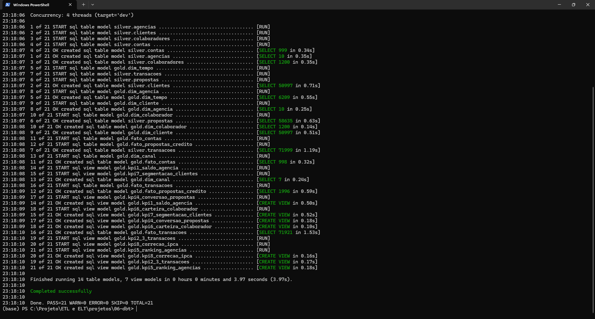
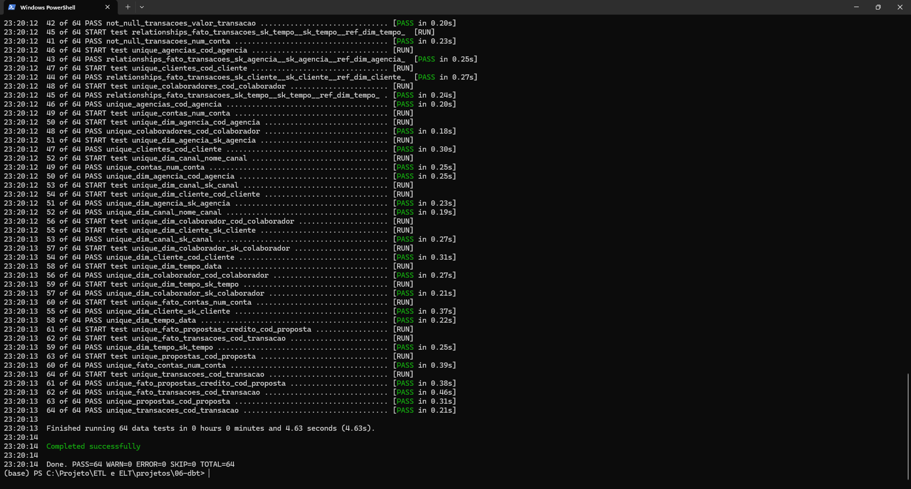
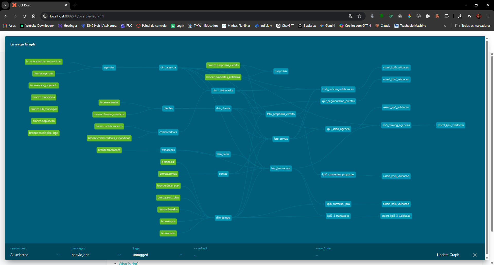

# Projeto 6 — dbt (Modern Data Stack)

Este projeto faz as transformações do BanVic usando o **dbt** (data build tool) — uma ferramenta que organiza SQL em arquivos separados, testa automaticamente os dados e gera documentação com um clique.

**Pergunta principal:** _Como trabalhar em transformações SQL em equipe sem virar uma bagunça?_

---

## O problema que o dbt resolve

Imagine um time de 5 engenheiros trabalhando nos mesmos scripts SQL. Alguém muda um campo, quebra o script de outra pessoa. Ninguém sabe qual query depende de qual. Não tem testes. Não tem documentação.

O dbt resolve isso: cada transformação é um arquivo SQL separado, versionado no git. As dependências são declaradas explicitamente. Os testes rodam automaticamente. A documentação é gerada do próprio código.

---

## Resultado

```
21 models criados — 64 testes passando — APROVADO
```

---

## Prints

### dbt run — 21 models criados com sucesso



### dbt test — 64 testes passando



### Lineage Graph — Bronze → Silver → Gold → KPIs



---

## Arquivos do projeto

```
projetos/06-dbt/banvic_dbt/
├── models/
│   ├── sources.yml                  Declara de onde vêm os dados (tabelas Bronze)
│   ├── silver/
│   │   ├── schema.yml               Testes: chave única, sem nulos, valores aceitos
│   │   ├── clientes.sql             Bronze → Silver (real + sintético, sem duplicatas)
│   │   ├── contas.sql
│   │   ├── transacoes.sql           Deriva o canal da transação pelo nome
│   │   ├── agencias.sql
│   │   ├── colaboradores.sql
│   │   └── propostas.sql
│   └── gold/
│       ├── dims/
│       │   ├── dim_tempo.sql        Calendário 2010–2026 com Selic, CDI, IPCA por dia
│       │   ├── dim_cliente.sql
│       │   ├── dim_agencia.sql
│       │   ├── dim_colaborador.sql
│       │   └── dim_canal.sql
│       ├── fatos/
│       │   ├── fato_transacoes.sql
│       │   ├── fato_contas.sql
│       │   └── fato_propostas_credito.sql
│       └── marts/
│           ├── kpi1_saldo_agencia.sql
│           └── kpi4_conversao_propostas.sql
├── macros/
│   └── faixa_etaria.sql             Lógica de faixa etária reutilizável
└── tests/
    └── assert_kpi1_validacao.sql    Testa se o saldo total bate com o gabarito
```

---

## Como executar

### Pré-requisitos

O banco precisa estar rodando com os dados Bronze carregados:

```bash
# Na raiz do projeto
docker compose up -d
python scripts/carga_bronze.py
```

### Pipeline completo

**Windows:**
```bat
cd projetos\06-dbt
run.bat
```

**Linux/Mac:**
```bash
cd projetos/06-dbt
chmod +x run.sh && ./run.sh
```

**O que você vai ver na tela:**
```
Running with dbt=1.8.0

Found 17 models, 23 tests, 1 source

Concurrency: 4 threads

1 of 17 START sql table model silver.clientes ..................... [RUN]
1 of 17 OK created sql table model silver.clientes ............... [SELECT 50998 in 3.21s]
2 of 17 START sql table model silver.contas ...................... [RUN]
...
17 of 17 OK created sql table model gold.fato_propostas_credito .. [SELECT 56635 in 2.11s]

Finished running 17 table models in 0 hours 0 minutes and 42 seconds.

Completed successfully.
```

### Comandos individuais

```bash
# Transformar Bronze → Silver → Gold
docker compose run --rm --name banvic-p06-dbt dbt run --profiles-dir /banvic_dbt

# Rodar os testes de qualidade de dados
docker compose run --rm --name banvic-p06-dbt dbt test --profiles-dir /banvic_dbt

# Gerar a documentação
docker compose run --rm --name banvic-p06-dbt dbt docs generate --profiles-dir /banvic_dbt

# Abrir a documentação no navegador (http://localhost:8081)
docker compose run --rm -p 8081:8080 dbt docs serve
```

### Sem Docker

```bash
pip install dbt-postgres==1.8.0
cd projetos/06-dbt/banvic_dbt

# Variáveis de conexão (Linux/Mac)
export BANVIC_PG_HOST=localhost
export BANVIC_PG_USER=banvic_user
export BANVIC_PG_PASSWORD=banvic_pass
export BANVIC_PG_DATABASE=banvic

# Variáveis de conexão (Windows PowerShell)
$env:BANVIC_PG_HOST="localhost"
$env:BANVIC_PG_USER="banvic_user"
$env:BANVIC_PG_PASSWORD="banvic_pass"
$env:BANVIC_PG_DATABASE="banvic"

dbt run --profiles-dir .
dbt test --profiles-dir .
```

---

## Como o dbt funciona na prática

### `{{ ref() }}` — dependências declaradas

Em vez de escrever o nome da tabela diretamente, você usa `ref()`:

```sql
-- fato_transacoes.sql
SELECT ...
FROM {{ ref('silver_transacoes') }}   -- dbt sabe que depende de silver_transacoes
JOIN {{ ref('dim_tempo') }}           -- e de dim_tempo
```

O dbt descobre a ordem correta de execução sozinho — você não precisa se preocupar com sequência.

### Testes automáticos no YAML

```yaml
# schema.yml
models:
  - name: silver_clientes
    columns:
      - name: cod_cliente
        tests:
          - not_null      # nunca pode ser nulo
          - unique        # nunca pode repetir
```

Rodar `dbt test` verifica isso automaticamente. Se uma coluna tiver nulo ou duplicata, o teste falha com mensagem clara.

---

## Testes incluídos no projeto

| Tipo de teste | Exemplo | O que verifica |
|---|---|---|
| `not_null` | `silver.clientes.cod_cliente` | Chaves nunca são nulas |
| `unique` | `gold.dim_tempo.sk_tempo` | Sem linhas duplicadas |
| `accepted_values` | `silver.transacoes.canal` | Canal só aceita os 9 valores mapeados |
| `relationships` | `fato_transacoes → dim_tempo` | Toda transação tem uma data válida |
| Singular test | `assert_kpi1_validacao.sql` | Saldo total bate com o gabarito |

---

## Se algo não funcionar

**"Could not find profile named 'banvic'"**
```bash
# O arquivo profiles.yml não foi encontrado
# Use o flag --profiles-dir apontando para a pasta correta:
dbt run --profiles-dir projetos/06-dbt/banvic_dbt
```

**"Could not connect to banvic database"**
```bash
docker compose up -d   # na raiz do projeto
# Verifique as variáveis de ambiente BANVIC_PG_HOST, BANVIC_PG_USER, etc.
```

**"Relation bronze_clientes does not exist"**
```bash
python scripts/carga_bronze.py   # carrega o Bronze primeiro
```

**Teste falhou — o que fazer?**
```bash
# Ver detalhes do teste que falhou:
dbt test --profiles-dir . --select silver_clientes
# O dbt mostra quantas linhas falharam e o SQL que foi executado
```

---

## dbt vs os outros projetos

| O que você precisa | SQL Puro | Python | Airflow | dbt |
|---|---|---|---|---|
| Ordem de execução | Manual | Manual | DAG explícita | Automática via `ref()` |
| Testes de dados | Nenhum | Unittest | Nenhum | Embutido no YAML |
| Documentação | Nenhuma | Nenhuma | Nenhuma | Gerada automaticamente |
| Rastreabilidade dos dados | Nenhuma | Nenhuma | Gráfico de tarefas | Grafo completo |
| Trabalho em equipe | Difícil | Médio | Médio | Fácil — SQL padrão |

---

## Quando usar dbt

| Situação | Faz sentido? |
|---|---|
| Time de dados que escreve SQL | Sim — curva de aprendizado baixa |
| Precisar de testes e documentação automáticos | Sim — é o ponto forte |
| Warehouse já consolidado (Snowflake, BigQuery, PostgreSQL) | Sim |
| Transformações com lógica Python ou Machine Learning | Não — use Python puro |
| Carregar dados no banco (parte do Bronze) | Não — dbt só transforma, não move dados |
| Precisar de agendamento e retry | Com integração — use dbt + Airflow juntos |
