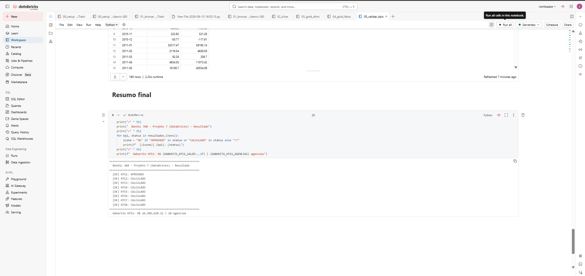

# Projeto 7 — Databricks Lakehouse

Este projeto faz o mesmo pipeline do BanVic usando **PySpark + Delta Lake no Databricks** — a plataforma usada quando os dados são grandes demais para caber em uma só máquina.

**Pergunta principal:** _O que muda quando o dado não cabe mais em uma máquina?_

---

## O problema que o Databricks resolve

Os projetos anteriores rodam no seu computador: o banco fica local, o Python processa localmente. Isso funciona para o BanVic (70k transações), mas um banco real pode ter 100 milhões de transações por dia.

O Databricks distribui o processamento em vários computadores ao mesmo tempo (cluster). Os dados ficam em **Delta Lake** — um formato de arquivo que tem as vantagens de um banco de dados (ACID, histórico de versões) com as vantagens de um data lake (barato, escala infinita).

---

## Resultado

```
8/8 KPIs corretos — APROVADO
```

---

## Arquivos do projeto

```
projetos/07-databricks/
├── notebooks/
│   ├── 00_setup.py          Cria os databases, verifica os CSVs no DBFS
│   ├── 01_bronze.py         CSV → Delta Bronze (35 tabelas + compactação)
│   ├── 02_silver.py         Bronze → Silver (limpeza + tipagem + união real+sintético)
│   ├── 03_gold_dims.py      Silver → Dimensões Gold (5 dimensões + dim_tempo)
│   ├── 04_gold_fatos.py     Silver → Fatos Gold (3 tabelas fato)
│   └── 05_validar_kpis.py   8 KPIs via Spark SQL + comparação com gabarito
├── dlt/
│   └── banvic_pipeline_dlt.py  Versão alternativa usando Delta Live Tables
├── job_config.json          Configuração do Job Databricks (agendamento automático)
├── prints/                  Screenshots da execução no Databricks
├── run.bat                  Windows: importa notebooks + cria job via CLI
└── run.sh                   Linux/Mac: idem
```

---

## Este projeto roda na nuvem

Diferente dos outros projetos, este não roda no seu computador local. Ele roda no **Databricks Community Edition** — que é gratuito para aprendizado.

Para criar sua conta gratuita: [community.cloud.databricks.com](https://community.cloud.databricks.com)

---

## Como executar

### Passo 1 — Criar cluster no Databricks

1. Faça login no Databricks Community Edition
2. Vá em **Compute → Create Cluster**
3. Configurações:
   - Nome: `banvic-cluster`
   - Single Node
   - Databricks Runtime: **14.3 LTS** (importante — versões diferentes podem dar erro)
4. Clique em **Create Cluster** e aguarde ~3 minutos

### Passo 2 — Subir os CSVs para o Databricks

Os dados precisam estar no DBFS (sistema de arquivos do Databricks).

**Opção A — pela interface visual (mais fácil):**
1. No Databricks: menu **Catalog → Add data → Upload files**
2. Faça upload das pastas na ordem:
   - `data/banvic/` → para `/FileStore/banvic/csv/banvic/`
   - `data/sintetico/` → para `/FileStore/banvic/csv/sintetico/`
   - `external_data/` → para `/FileStore/banvic/csv/external_data/`

**Opção B — pela linha de comando:**
```bash
pip install databricks-cli
databricks configure --token   # cole o token do seu workspace

databricks fs mkdirs dbfs:/FileStore/banvic/csv
databricks fs cp -r data/banvic/      dbfs:/FileStore/banvic/csv/banvic/
databricks fs cp -r data/sintetico/   dbfs:/FileStore/banvic/csv/sintetico/
databricks fs cp -r external_data/    dbfs:/FileStore/banvic/csv/external_data/
```

### Passo 3 — Importar os notebooks

1. No Databricks: **Workspace → Import**
2. Selecione cada arquivo `.py` da pasta `notebooks/`
3. Os notebooks aparecem no seu workspace

### Passo 4 — Executar em ordem

Execute um por vez, aguardando cada um terminar antes do próximo:

```
00_setup.py → 01_bronze.py → 02_silver.py → 03_gold_dims.py → 04_gold_fatos.py → 05_validar_kpis.py
```

**O que você vai ver no notebook 05_validar_kpis:**
```
KPI1 - Saldo por Agencia:
  Gabarito: 26509620.12
  Calculado: 26509620.12
  Status: APROVADO

...

8/8 KPIs aprovados - TODOS CORRETOS
```

---

## Resultados da execução

### Três schemas criados (Bronze / Silver / Gold)


> `banvic_bronze`, `banvic_silver` e `banvic_gold` no Unity Catalog com 35 tabelas Delta.

### Bronze — 25 tabelas Delta carregadas


### Silver — 6 tabelas transformadas


### Validação — 8/8 KPIs aprovados



> KPI1: saldo R$ 26.509.620,12 — exatamente o gabarito. Zero divergência.

---

## O que é Delta Lake

Delta Lake é um formato de armazenamento que funciona em cima de arquivos Parquet e adiciona:

- **ACID**: transações seguras — ou salva tudo, ou não salva nada
- **Time Travel**: você pode consultar como a tabela estava ontem, ou na versão 3
- **Schema enforcement**: rejeita automaticamente dados com formato errado
- **OPTIMIZE**: consolida arquivos pequenos em arquivos maiores (mais rápido para ler)

Exemplo de time travel:
```python
# Como estava a tabela antes de qualquer mudança
spark.read.format("delta").option("versionAsOf", 0).table("banvic_bronze.transacoes")

# Ver o histórico completo de mudanças
spark.sql("DESCRIBE HISTORY banvic_bronze.transacoes").show()
```

---

## Delta Live Tables — a abordagem declarativa

O arquivo `dlt/banvic_pipeline_dlt.py` mostra uma abordagem diferente: em vez de dizer **como** processar, você diz **o que** a tabela precisa conter. O Databricks cuida do resto.

```python
@dlt.table(name="silver_clientes")
@dlt.expect_or_fail("cod_cliente nao nulo", "cod_cliente IS NOT NULL")
def silver_clientes():
    # Só descreve o que a tabela deve ter
    return spark.read.table("banvic_bronze.clientes")
```

| | Notebooks manuais | Delta Live Tables |
|---|---|---|
| Ordem de execução | Você define | Automática |
| Retry em caso de falha | Configurar no Job | Embutido |
| Monitoramento de qualidade | Manual | Dashboard automático |
| Rastreabilidade dos dados | Nenhuma | Grafo interativo |
| Disponível no Community Edition | Sim | Não (requer plano pago) |

---

## Se algo não funcionar

**"FileNotFoundException: /FileStore/banvic/csv/banvic/"**
```
Os CSVs não foram carregados ainda.
Volte ao Passo 2 e faça o upload dos arquivos.
```

**"AnalysisException: Database 'banvic_bronze' not found"**
```
Execute o notebook 00_setup.py primeiro.
Ele cria os databases necessários.
```

**O cluster foi encerrado no meio da execução**
```
O Community Edition encerra clusters após 2h de inatividade.
Clique em "Reconnect" no notebook ou recrie o cluster.
O progresso não é perdido — os dados já salvos em Delta continuam lá.
```

**Diferença nos KPIs**
```
Certifique que o cluster usa DBR 14.3 LTS (não outra versão).
Certifique que os CSVs foram carregados nos caminhos corretos.
```

---

## Databricks vs os outros projetos

| O que você precisa | SQL / Python / Airflow / dbt | Databricks |
|---|---|---|
| Volume de dados | Limitado à memória do servidor | Petabytes (cluster distribuído) |
| Histórico e auditoria de dados | Não | Sim — Delta Time Travel |
| Processamento em paralelo | Não ou limitado | Sim — cluster Spark |
| Transações ACID em arquivos | Não | Sim — Delta Lake |
| Integração com Machine Learning | Limitada | Nativa — MLflow, Feature Store |
| Custo | Gratuito (local) | Pago (cloud) |

---

## Quando usar Databricks

| Situação | Faz sentido? |
|---|---|
| Volume acima de 100 GB de dados | Sim — cluster distribui o processamento |
| Precisar de time travel e ACID em data lake | Sim — Delta Lake resolve isso |
| Machine Learning sobre os dados transformados | Sim — MLflow integrado |
| Volume abaixo de 10 GB, budget limitado | Não — PostgreSQL + dbt é mais simples e gratuito |
| Pipeline simples de ingestão | Talvez — Airflow pode ser suficiente |
