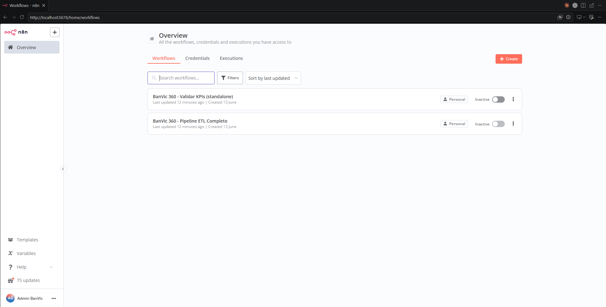
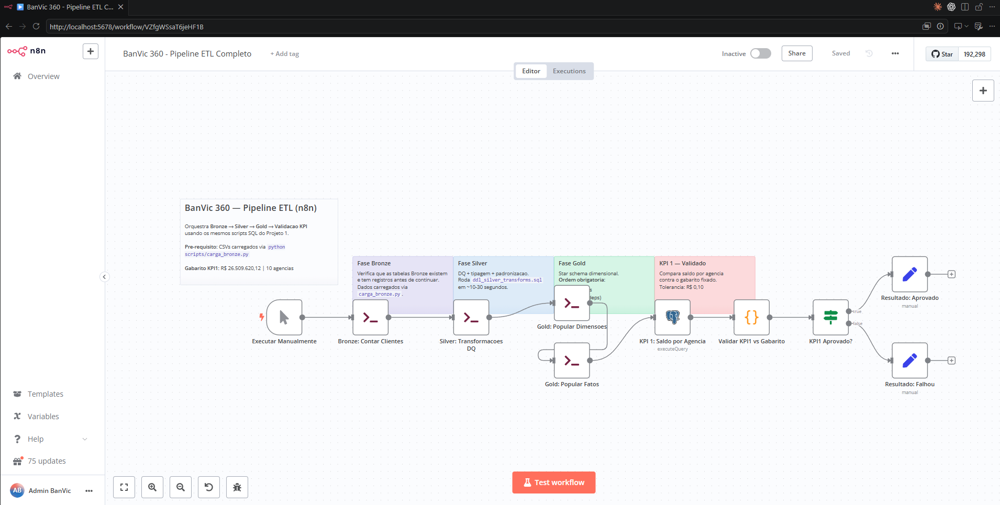
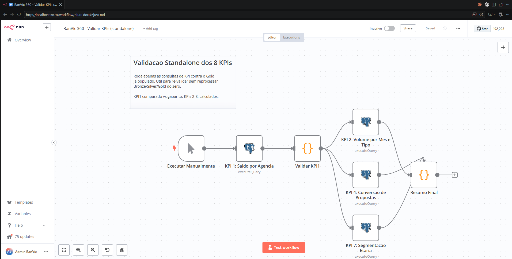
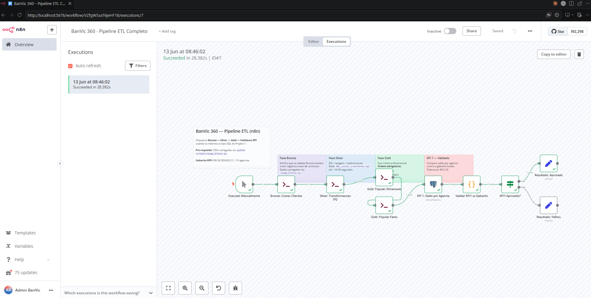
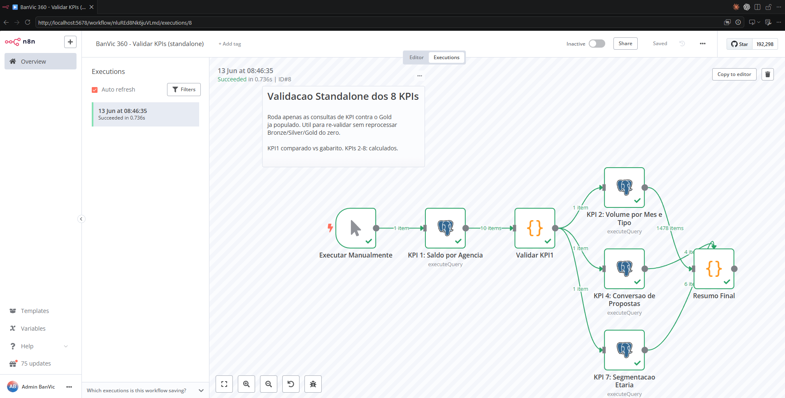

# Projeto 8 — n8n: Automação Visual

Este projeto faz o mesmo pipeline do BanVic usando o **n8n** — uma ferramenta de automação visual onde você monta fluxos de trabalho conectando blocos na tela, sem precisar programar.

**Pergunta principal:** _O que muda quando qualquer pessoa do time consegue entender e modificar o pipeline?_

---

## O que é o n8n

n8n é como o Zapier ou Make (Integromat), mas que você instala no seu próprio servidor. Você conecta serviços diferentes — banco de dados, APIs, e-mail, Slack — arrastando blocos e configurando campos.

O resultado é visual e interativo: você vê cada bloco ficando verde (sucesso) ou vermelho (erro) em tempo real enquanto o pipeline executa.

---

## Por que o n8n é diferente do Airflow

Ambos agendam e orquestram pipelines. A diferença é quem consegue usar:

| Aspecto | Airflow (Projeto 5) | n8n (Projeto 8) |
|---|---|---|
| Como você define o pipeline | Código Python | Arrastar blocos na tela |
| Modificar um passo | Editar arquivo + novo deploy | Clicar no bloco + salvar |
| Ver o fluxo funcionando | Diagrama estático | Animação em tempo real |
| Lidar com erros | `try/except` no código | Bloco `IF` com seta vermelha |
| Enviar alerta por e-mail ou Slack | Configurar no código | Bloco nativo, pronto |
| Quem consegue manter | Engenheiro de dados | Engenheiro + Analista + Operações |

**O resultado é o mesmo. O caminho é diferente. A audiência é diferente.**

---

## Resultado

| KPI | Resultado |
|---|---|
| KPI 1 — Saldo total | R$ 26.509.620,12 (10 agências) ✔ validado vs gabarito |
| KPI 2 — Volume de transações | R$ 58.122.708,67 (71.921 tx, 155 meses) |
| KPI 4 — Propostas | 525 Enviada / 513 Aprovada / 490 Validação / 468 Em análise |

---

## Prints

### Overview — dois workflows importados



### Pipeline ETL Completo — canvas



### Validação de KPIs — canvas



### Pipeline ETL — execução com sucesso (28.4s, todos os nós verdes)



### Validação de KPIs — execução com sucesso (0.74s, todos os nós verdes)



---

## Arquivos do projeto

```
projetos/08-n8n/
├── workflows/
│   ├── 01_pipeline_banvic.json   Pipeline completo: Bronze → Silver → Gold → KPI
│   └── 02_validar_kpis.json      Validação standalone (Gold já populado)
├── prints/
│   ├── 01_overview.png            UI do n8n — lista dos workflows
│   ├── 02_pipeline_canvas.png     Canvas do Pipeline ETL
│   ├── 03_validar_kpis_canvas.png Canvas do Validar KPIs
│   ├── 04_execucao_pipeline.png   Execucao bem-sucedida — Pipeline ETL (28s)
│   └── 05_execucao_validar_kpis.png Execucao bem-sucedida — Validar KPIs (0.74s)
├── Dockerfile                    n8n + psql + python3 (imagem customizada)
├── docker-compose.yml            n8n + PostgreSQL em rede isolada (porta 5434)
├── run_automacao.py              Automação completa end-to-end
└── .env.example                  Configurações
```

---

## Como executar

### Pré-requisito

Docker Desktop instalado e rodando. Python 3 com `requests` instalado no host.

### Automação completa (recomendado)

Da raiz do projeto:

```bash
python projetos/08-n8n/run_automacao.py
```

O script faz tudo automaticamente:
1. Sobe os containers (PostgreSQL na porta 5434 + n8n na porta 5678)
2. Aguarda o n8n inicializar
3. Carrega o Bronze via `carga_bronze.py`
4. Configura o owner e autentica no n8n
5. Cria a credencial PostgreSQL
6. Importa os dois workflows
7. Executa o Pipeline ETL e depois a Validação de KPIs

Ao final, o n8n fica disponível em `http://localhost:5678`.
Login: `admin@banvic.com` / `Banvic2024!`

### Para parar

```bash
docker compose -f projetos/08-n8n/docker-compose.yml down
```

---

## Como o pipeline está organizado

```
[Executar Manualmente]
         |
[Bronze: Contar Clientes]   <- verifica que os dados chegaram
         |
[Silver: Transformacoes DQ] <- roda ddl_silver_transforms.sql + ddl_gold
         |
[Gold: Popular Dimensoes]   <- roda 01_populate_dims.sql
         |
[Gold: Popular Fatos]       <- roda 02_populate_fatos.sql
         |
[KPI 1: Saldo por Agencia]  <- consulta direta no banco (PostgreSQL node)
         |
[Validar KPI1 vs Gabarito]  <- JavaScript: compara vs R$ 26.509.620,12
         |
[KPI1 Aprovado?]            <- bloco IF com duas saidas
    |              |
[Aprovado]     [Falhou]
```

**Workflow 2 (standalone):** executa KPI1, KPI2, KPI4 e KPI7 em paralelo contra o Gold já populado.

---

## Por que o n8n reutiliza o SQL do Projeto 1

Os blocos `Execute Command` chamam os mesmos arquivos SQL que já existem:

```bash
psql -f /data/banvic/sql/02_silver/ddl_silver_transforms.sql
psql -f /data/banvic/projetos/01-sql-puro/sql/01_populate_dims.sql
psql -f /data/banvic/projetos/01-sql-puro/sql/02_populate_fatos.sql
```

Isso mostra o papel correto do n8n: ele é um **orquestrador**, não um reescritor. Você não joga fora o SQL que já funciona — você o agenda e monitora visualmente.

---

## Decisões técnicas

| Decisão | Motivo |
|---|---|
| PostgreSQL isolado na porta 5434 | P04 usa 5433; evitar conflito |
| `N8N_SECURE_COOKIE=false` | n8n 1.x define cookie Secure mesmo em HTTP — Python não envia em localhost |
| Execução via `docker exec n8n execute` | REST `/run` retorna 500 em certos fluxos; CLI é mais confiável |
| Sem Merge node no wf01 | Merge v3 com `passThrough` falha quando apenas 1 dos inputs dispara via CLI |
| `TO_CHAR(t.data, 'YYYY-MM')` no KPI2 | `dim_tempo` não tem coluna `ano_mes`; usar função de formatação |
| `.first()` no Code node com fan-in | `$('Node').item` falha com múltiplos inputs; `.first()` é necessário |

---

## Se algo não funcionar

**n8n não abre em localhost:5678**
```bash
docker ps
docker logs banvic-p08-n8n --tail 30
```

**Erro 401 na automação**
```
Normal na primeira execução se o owner ainda não foi criado.
O script run_automacao.py faz o setup automaticamente.
```

**Bloco vermelho "Execute Command"**
```
Verificar se o container postgres está saudável:
docker ps | grep postgres
docker logs banvic-p08-postgres --tail 20
```

**"Table does not exist" no bloco Silver**
```bash
# Bronze não foi carregado — rodar manualmente:
python scripts/carga_bronze.py
# (com PG_PORT=5434 e PG_HOST=localhost nas variáveis de ambiente)
```

---

## Quando usar n8n

| Situação | Faz sentido? |
|---|---|
| Time misto (devs + analistas + operações) | Sim — todos conseguem entender |
| Integrações com APIs, webhooks, e-mail, Slack | Sim — blocos nativos para tudo |
| Pipelines simples a médios | Sim — zero overhead de infraestrutura |
| DAGs com centenas de tarefas complexas | Não — Airflow é mais robusto |
| Transformações pesadas em Python | Não — Airflow ou Projeto 2 |
| Volume acima de 100 GB | Não — Databricks (Projeto 7) |
| Notificações e alertas operacionais | Sim — bloco de e-mail/Slack nativo |
